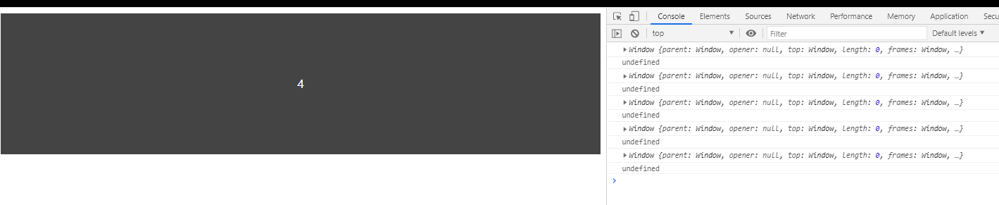

<!--
 * @Author: angula
 * @Date: 2020-09-14 16:52:40
 * @LastEditTime: 2020-09-14 21:38:08
 * @FilePath: \JS\Github-前端知识总结仓库\studySummary\JS相关\防抖节流\防抖.md
-->
# 防抖
## 防抖原理

事件响应函数在一段时间后才执行，如果这段时间内再次调用，则重新计算执行时间

也就是说,在这个时间内,无论你怎么触发事件,我都不会执行,只有这段时间无操作后才会执行!

**例如:**

假如防抖设置为3秒

第一次执行事件后，开始倒计时3秒

然后等到还剩余1秒时，再次触发了事件

重新倒计时，从三秒开始

这样第一次到第二次触发事件就经历了5秒，极大的减轻了服务器的压力


先来认识防抖函数的使用:
防抖函数实际上已经封装好了,我们只需要用cdn引入就可以进行使用了,但是我们依然要明白其中的原理!
```html
<!DOCTYPE html>
<html lang="en">

<head>
  <meta charset="UTF-8">
  <meta name="viewport" content="width=device-width, initial-scale=1.0">
  <title>Document</title>

  <style>
    #container {
      width: 100%;
      height: 200px;
      line-height: 200px;
      text-align: center;
      color: #fff;
      background-color: #444;
      background-size: 30px;
    }
  </style>
</head>

<body>
  <div id="container"></div>
  <script src="https://cdn.bootcdn.net/ajax/libs/underscore.js/1.11.0/underscore.js"></script>
  <script src="./debounce.js"></script>


  <script>
    let count = 0;
    // 展示事件频繁发生
    let container = document.querySelector('#container');

    function doSomething(e) {
      // event
      console.log(e);
      console.log(this)
      // 这里可能是回调或者是ajax请求
      // 这里做个示例
      container.innerHTML = count++
    }

    // !无防抖，数字会不停的增加，相当于不断的发送请求
    // container.onmousemove = doSomething;

    // 使用防抖，300ms内不会重复发出请求
     container.onmousemove = _.debounce(doSomething, 300);
```


这样鼠标滑过的话,就会不断的触发事件,不停的发送请求,会给服务器带来极大的压力
> 针对这种问题,防抖节流的重要性就来了,它们可以降低函数的触发频率,提高性能,避免资源浪费

## 手动实现防抖函数

明白其原理之后,我们就可以慢慢实现一个防抖函数

定义一个debounce.js文件
```js
//简单构造出防抖大致框架
//func 要执行的函数，wait要等待的时间
function debounce(func, wait) {
  let timeout;
  return function () {
    // 清空定时器
    if(timeout) clearTimeout(timeout);
    timeout = setTimeout(func, wait)
  }

}
```
这样一个最最最基础的防抖就搭建好了,并没有什么难度,只需要规定时间不执行函数就可以啦!
当然为了检验我们的成果,我们可以测试一下

```js
container.onmousemove = debounce(doSomething, 300)
```

结果:


很明显,此时防抖函数已经起作用啦,但这是可以从控制台看到打印了一些东西\

这就是我们接下来要解决的问题啦
```js
function doSomething(e) {
      // event
      console.log(e);   //MouseEvent
      console.log(this)   //window
      // 这里可能是回调或者是ajax请求
      // 这里做个示例
      container.innerHTML = count++
    }
```

> 我们此次需要解决两个问题,this和e的指向问题.
> dom节点在触发事件的时候,this是指向本身的,在这里理论上是应该指向container的
> 但是很遗憾经过匿名函数的包裹,this指向了window,所有我们需要修复它,当然也比较简单,在匿名函数前,this是指向container的,所以我们只需要在匿名函数之前将this保存即可

```js
function debounce(func, wait) {
  let timeout;
  return function () {
    // console.log(this);  //=>从中可以测试出this指向的container
    //保存this
    let _this = this;
    // 清空定时器
    if(timeout) clearTimeout(timeout);
    timeout = setTimeout(function () {
      // console.log(this)  //=>这里面的this指向window，也就是前面的count那的this是指向window
      //但是防抖函数的this应该是指向container
      func.apply(_this);

    }, wait)
  }

}

```

> event的问题:事件处理函数有event对象,然后在测试中,e却是undefined,所以我们需要修正它为mouseEvennt

```js
function doSomething(e) {
      // event
      console.log(e);   //undefined
      console.log(this)   //window
      container.innerHTML = count++
    }
```
修改:
```js
function debounce(func, wait) {
  let timeout;
  return function () {
    // console.log(this);  //=>从中可以测试出this指向的container
    //保存this
    let _this = this;
    // 解决前面的event指向问题
    let args = arguments;
    // 清空上从定时器
    clearTimeout(timeout);
    timeout = setTimeout(function () {
      // console.log(this)  //=>这里面的this指向window，也就是前面的count那的this是指向window
      //但是防抖函数的this应该是指向container
      func.apply(_this, args);

    }, wait)
  }

}


```
这样,再次测试,event已经是指向mouseEvent了.这和防抖的源码已经相同啦,这时已经可以解决大多数问题了!

## 防抖完善优化
原生防抖中会存在第三个参数,true,表示立即执行,而我们此次的目的,就是完善这个功能!
```js
debounce(doAnother, 300,true)
```

前面的防抖函数,需要经历n秒的等待时间,才会执行
而立即执行就是说,开头需要立即执行,然后等待n秒,如果期间有触发事件,则等待期推迟n秒!然后再执行

当然,只靠说你可能不太清楚,那么我们来完善一下
```js
function debounce(func, wait, immediate) {
  let timeout;
  return function () {
    // console.log(this);  //=>从中可以测试出this指向的container
    //保存this
    let _this = this;
    // 解决前面的event指向问题
    let args = arguments;
    // 清空上从定时器
     if(timeout) clearTimeout(timeout);

    if (immediate) {
      //若执行过了,不再执行
      let callNow = !timeout;    //callNow起始值为true,timeout刚开始为undefined,则作取反操作,那么就可以保证callNow初始值为true.
      timeout = setTimeout(() => {
        timeout = null;  //在wait内,timeout是一个id数字,在在此期间callNow为false,func函数不会执行!
      }, wait);
      //初始为true会直接执行,在wait时间之内,callNow设置为timeout有值,则callNow为false,此时不执行,在wait时间之后,timeout设置为null,此时callNow为true开始执行
      if (callNow) func.apply(_this, args);

    } else {
      timeout = setTimeout(function () {
        // console.log(this)  //=>这里面的this指向window，也就是前面的count那的this是指向window
        //但是防抖函数的this应该是指向container
        func.apply(_this, args);

      }, wait)
    }


  }

}
```

这样,我们的立刻执行防抖就完善好了,可以亲自动手尝试一下

### 代码优化以及添加取消防抖功能
```js

function debounce(func, wait, immediate) {
  let timeout, result;

  // 检查func是否为函数
  if (typeof func !== 'function') {
    throw new TypeError('Expected a function');
  }

  // wait如果忘记设置,,默认为0
  wait = wait || 0;
  var debounced = function () {
    // console.log(this);  //=>从中可以测试出this指向的container
    //保存this
    let _this = this;
    // 解决前面的event指向问题
    let args = arguments;
    // 清空上从定时器
    if (timeout) clearTimeout(timeout);


    if (immediate) {
      let callNow = !timeout;
      timeout = setTimeout(() => {
        timeout = null;
      }, wait);
      if (callNow) result = func.apply(_this, args);

    } else {
      timeout = setTimeout(function () {
        // console.log(this)  //=>这里面的this指向window，也就是前面的count那的this是指向window
        //但是防抖函数的this应该是指向container
        func.apply(_this, args);

      }, wait)
    }

    return result;
  }


  //添加取消防抖函数功能
  debounced.cannel = function () {

    clearTimeout(timeout);
    timeout = null;
  }
  return debounced;

}
```


# 防抖函数常见应用
1. scroll事件的滚动触发
2. 搜索框输入查询
3. 表单验证
4. 按钮提交事件
5. 浏览器`窗口缩放,resize事件