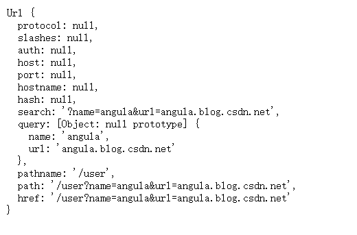
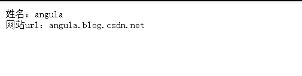
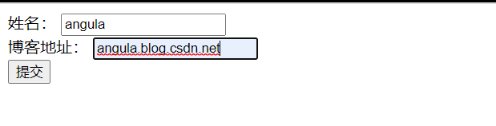
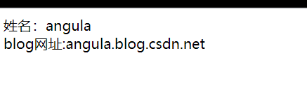

<!--
 * @Author: angula
 * @Date: 2020-09-23 20:45:04
 * @LastEditTime: 2020-09-23 21:36:18
 * @FilePath: \JS\Github-前端知识总结仓库\studySummary\Node.js学习笔记\GetPost请求\GetPost.md
-->
# GET/POST请求

## 获取GET请求内容

由于GET请求直接被嵌入到路径中，URL是完整的请求路径，包括了？后面的部分，因此可以手动解析后面的内容作为GET请求的参数
而node.js中的url模块中parse函数提供了这个功能

```js
const http = require('http');
const url = require('url');
const util = require('util');

http.createServer(function (req, res) {
  res.writeHead(200, { 'Content-type': 'text/plain;charset=utf-8' });
  res.end(util.inspect(url.parse(req.url, true, true)))
}).listen(3000)
```

在浏览器中访问 http://localhost:3000/user?name=angula&url=angula.blog.csdn.net ，查看返回的结果



## 获取url参数
使用url.parse()方法来解析URL中的参数
```js
http.createServer(function (req, res) {
  res.writeHead(200, { 'Content-Type': 'text/plain;charset=utf-8' });

  //解析url参数
  let params = url.parse(req.url, true).query;
  res.write('姓名：' + params.name);
  res.write('\n');
  res.write('网站url：' + params.url);
  res.end()
}).listen(3000)
```

在浏览器中访问 http://localhost:3000/user?name=angula&url=angula.blog.csdn.net ，查看返回的结果



# 获取post请求内容

post请求的内容全部的都在请求体中，http.ServerRequest并没有一个属性内容为请求体，原因是等待请求体传输可能是一件耗时的工作。

比如说上传文件，而很多时候完美可能并不需要例会请求体的内容，恶意的POST请求会大大小号服务器的资源，所以node默认是不会解析请求体的，当你需要的时候，需要手动来做。

## 基本结构

```js
var http = require('http');
var querystring = require('querystring');
var util = require('util');
 
http.createServer(function(req, res){
    // 定义了一个post变量，用于暂存请求体的信息
    var post = '';     
 
    // 通过req的data事件监听函数，每当接受到请求体的数据，就累加到post变量中
    req.on('data', function(chunk){    
        post += chunk;
    });
 
    // 在end事件触发后，通过querystring.parse将post解析为真正的POST请求格式，然后向客户端返回。
    req.on('end', function(){    
        post = querystring.parse(post);
        res.end(util.inspect(post));
    });
}).listen(3000);
```

## 举个例子

```js
const http = require('http')
const querystring = require('querystring');
var postHTML =
  '<html><head><meta charset="utf-8"><title>Test</title></head>' +
  '<body>' +
  '<form method="post">' +
  '姓名： <input name="name"><br>' +
  '博客地址： <input name="url"><br>' +
  '<input type="submit">' +
  '</form>' +
  '</body></html>';

http.createServer(function (req, res) {
  let post = '';
  //通过req的data事件监听函数，每当接受到请求体的数据，就累加到post的变量中。
  req.on('data', function (chunk) {
    post += chunk;
  });
  //end事件触发后，通过querystring.parse将post解析为真正的POST请求格式，然后向客户端返回。
  req.on('end', function () {
    //解析参数
    post = querystring.parse(post)
    //设置响应头部信息以及编码
    res.writeHead(200, { 'Content-Type': 'text/html;charset=utf-8' });

    if (post.name && post.url) {
      //输出提交的数据
      res.write('姓名：' + post.name);
      res.write('<br>')
      res.write('blog网址:' + post.url);
    } else {
      res.write(postHTML)
    }

    res.end();
  })
}).listen(3000)
```



