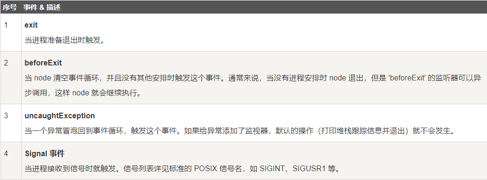
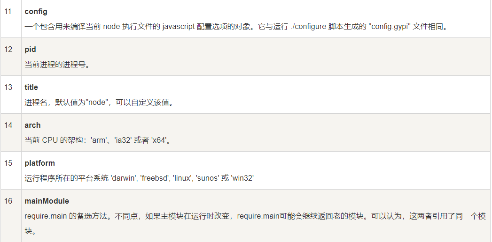
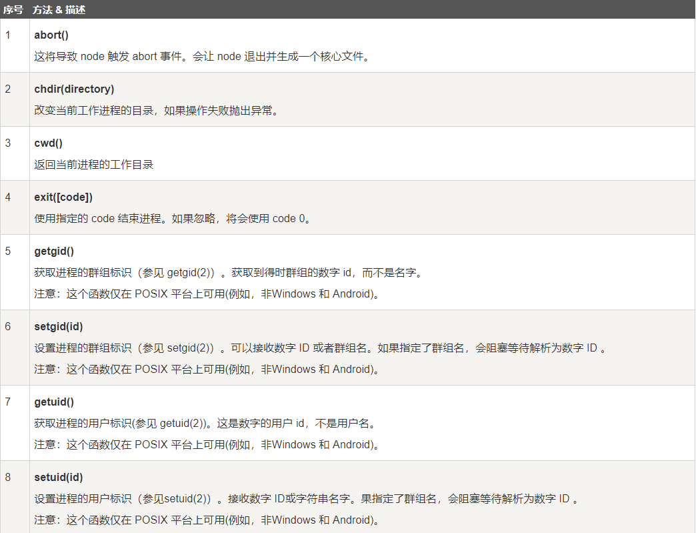
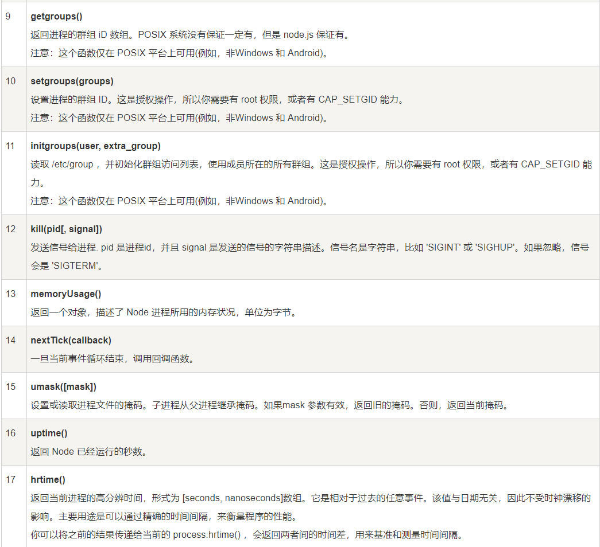
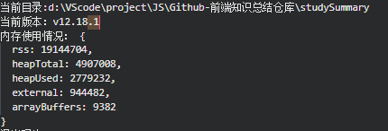

<!--
 * @Author: angula
 * @Date: 2020-09-23 14:37:26
 * @LastEditTime: 2020-09-23 16:16:35
 * @FilePath: \JS\Github-前端知识总结仓库\studySummary\Node.js学习笔记\全局对象\全局对象.md
-->
# 全局对象

avaScript 中有一个特殊的对象，称为全局对象（Global Object），它及其所有属性都可以在程序的任何地方访问，即全局变量

在浏览器 JavaScript 中，通常 window 是全局对象， 而 Node.js 中的全局对象是 global，所有全局变量（除了 global 本身以外）都是 global 对象的属性。

在 Node.js 我们可以直接访问到 global 的属性，而不需要在应用中包含它。

- 全局变量
   1. 在最外层定义的变量
   2. 全局对象的属性
   3. 隐式定义的变量

当定义一个全局变量的时候，这个变量同时也会成为全局对象的属性，反之亦然，需要注意的是，在Node.js中你不可能在最外层定义变量，因为用户代码都是属于当前模块的，而模块本身不是最外层上下文。

> 注意：最好不要使用var定义变量以避免引入全局变量，因为全局变量会污染命名空间，提高代码的耦合风险。

## 1. _filename

_filename表示当前正在执行的脚本的文件名。它将输出文件所在位置的绝对路径，且和命令行参数所指定的文件名不一定相同。如果在模块中返回的值是模块文件的路径。

## 2. _dirname

表示当前执行脚本所在的目录

## 3. setTimeout(func,ms)

在指定的毫秒(ms)后执行指定函数func。

setTimeout() 只执行一次指定函数。

返回一个代表定时器的句柄值。


## 4. clearTimeout(t)

用于停止一个之前通过setTimeout()创建的定时器，参数t是通过setTimeout()函数创建的定时器

## 5. setInterval(func,ms)

在指定的毫秒ms数后执行指定函数cb。
返回一个代表定时器的句柄值。可以使用clearInterval(t)函数来清楚定时器

**setInterval() 方法会不停地调用函数，直到 clearInterval() 被调用或窗口被关闭。**


# console

console 用于提供控制台标准输出，它是由 Internet Explorer 的 JScript 引擎提供的调试工具，后来逐渐成为浏览器的实施标准。

Node.js 沿用了这个标准，提供与习惯行为一致的 console 对象，用于向标准输出流（stdout）或标准错误流（stderr）输出字符。


# process

process 是一个全局变量，即 global 对象的属性。

它用于描述当前Node.js 进程状态的对象，提供了一个与操作系统的简单接口。通常在你写本地命令行程序的时候，少不了要 和它打交道。下面将会介绍 process 对象的一些最常用的成员方法。




```js
process.on('exit', code => {
  setTimeout(() => {
    console.log('该行代码不会执行');
  }, 0);
  console.log('退出码为：' + code);
})
console.log('程序执行结束')

//打印：程序执行结束  退出码为：0
```
## process属性





## process方法




```js
console.log('当前目录:' + process.cwd());
console.log('当前版本：' + process.version);
console.log('内存使用情况：', process.memoryUsage());
```

