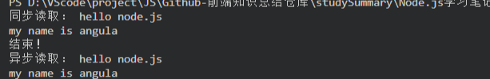
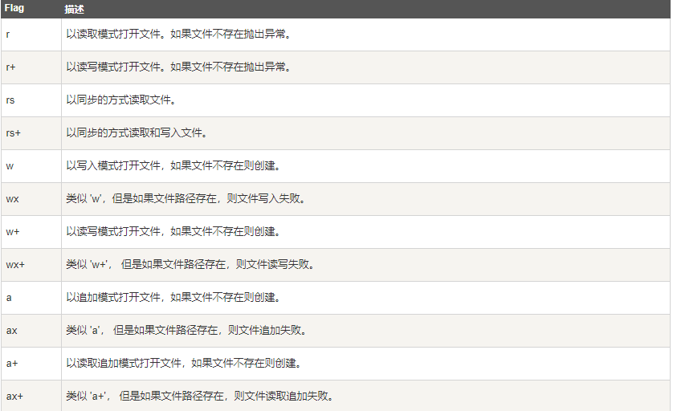
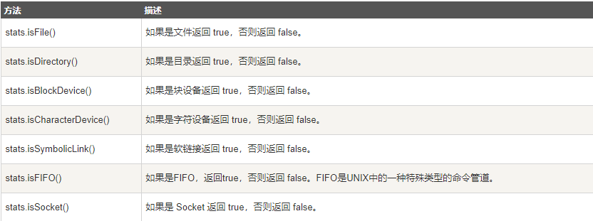
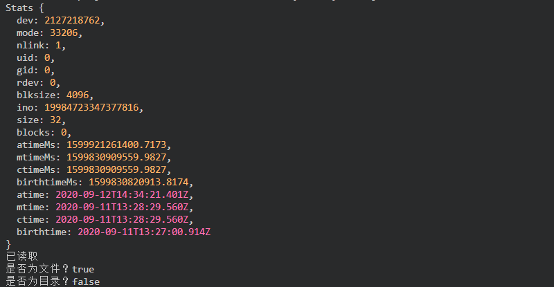
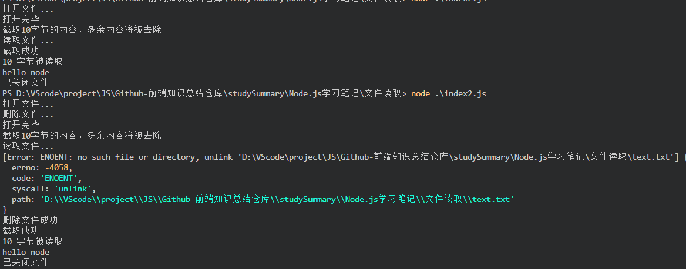

<!--
 * @Author: angula
 * @Date: 2020-09-12 16:55:54
 * @LastEditTime: 2020-09-13 00:11:02
 * @FilePath: \JS\Github-前端知识总结仓库\studySummary\Node.js学习笔记\文件读取\文件系统.md
-->
# 异步与同步

Node.js 文件系统（fs 模块）模块中的方法均有异步和同步版本，例如读取文件内容的函数有异步的 fs.readFile() 和同步的 fs.readFileSync()。

异步的方法函数最后一个参数为回调函数，回调函数的第一个参数包含了错误信息(error)。

**建议使用异步方法，比起同步，异步方法性能更高，速度更快，而且没有阻塞。**

示例：
```txt
//hello.txt

hello node.js
my name is angula
```

index.js文件
```js

var fs = require('fs');
//异步读取
fs.readFile('hello.txt', function (err, data) {
  if (err) {
    return console.log(err);
  }
  console.log('异步读取：', data.toString());
})


// 同步读取
var data = fs.readFileSync('hello.txt');
console.log('同步读取：', data.toString());

console.log('结束！')
```

结果：



# 打开文件
在异步模式下打开文件的语法格式
```js
fs.open(path,flags[,mode],callback)
```
## 参数
- path：文件路径
- flags：文件打开的行为
- mode：设置文件模式，文件创建默认权限为0666（可读可写）
- callback：回调函数，带有两个参数callback(err,fd);

flags参数可以是下列值：



对hello.txt进行独写

```js
var fs = require('fs');
// 异步打开文件

console.log('正在打开文件...');
fs.open('hello.txt', 'r+', function (err, fd) {
  if (err) {
    return console.log(err);
  }
  console.log('文件已打开');
})
```

## 获取文件信息
```
fs.stat(path,callback)   //path 路径 callback(err,stats) stats是fs.Stats的对象

```

fs.stat(path)执行后，会将stats类的实例返回给其回调函数。可以通过stats类中的提供方法判断文件的相关属性。例如判断是否为文件：
```js
fs.stat('./hello.txt', function (err, stats) {
  console.log(stats.isFile());  //true
})

```

**stats类中的方法**



举个例子
```js
fs.stat('hello.txt', function (err, stats) {
  if (err) {
    return console.log(err);
  }
  console.log(stats);
  console.log('已读取');

  // 检测文件类型
  console.log('是否为文件？' + stats.isFile());
  console.log('是否为目录？' + stats.isDirectory());
})
```

结果：



## 写入文件
```
fs.writeFile(file,data[,options],callback)
```

参数：
- file：文件名
- data：要写入文件的数据，可以是String 或Buffer对象
- options：该参数是一个对象，包含{encoding，mode，flag}，默认编码为utf-8，模式为0666，flag为W
- callback：回调函数，只包含错误参数err，写入失败时返回


## 读取文件
```js
fs.read(fd, buffer, offset, length, position, callback)
```
参数：
- fd：通过 fs.open() 方法返回的文件描述符。
- buffer：数据写入的缓冲区。
- offset ：缓冲区写入的写入偏移量。
- length ： 要从文件中读取的字节数。
- position ：文件读取的起始位置，如果 position 的值为 null，则会从当前文件指针的位置读取。
- callback - 回调函数，有三个参数err, bytesRead, buffer，err 为错误信息， bytesRead 表示读取的字节数，buffer 为缓冲区对象。

## 关闭文件
异步关闭文件
```
fs.close(fd,callback);
```
参数
- fd ：d - 通过 fs.open() 方法返回的文件描述符。
- callback - 回调函数，没有参数。


## 截取文件

```
fs.ftruncate(fd,len,callback)
```

参数：
- fd - 通过 fs.open() 方法返回的文件描述符。
- len - 文件内容截取的长度。
- callback - 回调函数，没有参数。

## 删除文件
```
fs.unlink(path,callback)
```

参数：
- path - 文件路径。
- callback - 回调函数，没有参数。

完整示例：
```js
var buf = new Buffer.alloc(1024);
console.log('打开文件...');
fs.open('hello.txt', 'r+', (err, fd) => {
  if (err) return err;

  console.log('打开完毕')

  // 截取文件
  console.log('截取10字节的内容，多余内容将被去除');
  fs.ftruncate(fd, 10, function (err) {
    if (err) {
      console.log(err);
    }
    console.log('截取成功')
  })

  console.log('读取文件...');

  fs.read(fd, buf, 0, buf.length, 0, (err, bytes) => {
    if (err) {
      console.log(err)
    }
    console.log(bytes + ' 字节被读取');

    //输出被读取的字节
    if (bytes > 0) {
      console.log(buf.slice(0, bytes).toString());
    }

    // 关闭文件
    fs.close(fd, function (err) {
      if (err) {
        console.log(err);
      }
      console.log('已关闭文件')
    })

    // 删除文件

  })


})

console.log('删除文件...');
fs.unlink('text.txt', function (err) {
  if (err) {
    console.log(err);
  }
  console.log('删除文件成功')
})
```

截屏：


# 目录
## 创建目录
```
fs.mkdir(path,[,options],callback)
```
参数：
- path - 文件路径。
- options 参数可以是：

  - recursive - 是否以递归的方式创建目录，默认为 false。
  - mode - 设置目录权限，默认为 0777。

- callback 回调函数，没有参数。

## 读取目录
```
fs.readdir(path,callback)
```
参数：
- path - 文件路径。
- callback - 回调函数，回调函数带有两个参数err, files，err 为错误信息，files 为 目录下的文件数组列表。


## 删除目录
```
fs.rmdir(path,callback)
```

参数：
- path - 文件路径。
- callback - 回调函数，没有参数。

完整示例：
```js
/*
 * @Author: angula
 * @Date: 2020-09-12 23:48:16
 * @LastEditTime: 2020-09-13 00:09:41
 * @FilePath: \JS\Github-前端知识总结仓库\studySummary\Node.js学习笔记\文件读取\目录.js
 */
var fs = require('fs')
console.log('创建目录');
fs.mkdir('./img/test', {
  recursive: true
}, function (err) {
  if (err) {
    console.log(err);
  } else {
    console.log('创建成功');
  }

})

// 读取目录
fs.readdir('./img', function (err, files) {
  if (err) {
    console.log(err);
  } else {
    files.forEach(function (file) {
      console.log(file);
    })
  }

})


// 删除目录
console.log('删除/img/test目录');
fs.rmdir('./img/test', function (err) {
  if (err) {
    console.log(err);
  } else {
    console.log('删除成功')
  }
})
```

