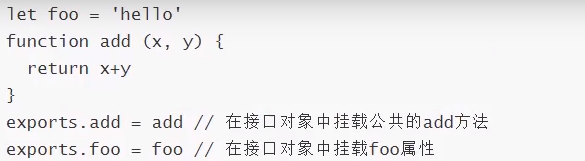
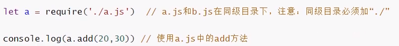
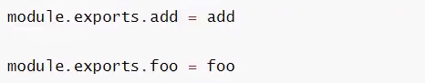

<!--
 * @Author: angula
 * @Date: 2020-09-11 10:14:11
 * @LastEditTime: 2020-09-11 11:09:01
 * @FilePath: \JS\Github-前端知识总结仓库\studySummary\Node.js学习笔记\模块导入导出\模块导入导出.md
-->
注意：node.js可以使得js脱离浏览器的窗口，独立运行在node.js提供的环境中，所以node.js中没有BOM，DOM这些概念
Nodejs中根本没有页面，主要进行一些服务器上的操作(比如：文件读写，网络通信)

Node.js采用的是Common]s规范,在NodeJS中, -般将代码合理拆分到不同的JS文件中,每-个文件就是一 个模块,而文件路径就是模块名。
在编写每个模块时,都有require、exports、 module三个预先定 义好的变量可供使用。
# require
require函数用来在一个模块中引入另外一 个模块。 传入一个模块名,返回一个模块导出对象。用法:1et CC =require("模块名") , 其中模块名可以用绝对路径也可以用相对路径模块的后缀名.js可以省略。例如:

> require()函数的两个作用
> - 执行导入的模块中的代码
> - 返回导入模块中的接口对象

Node中，每个模块都有一个exports接口对象,我们需要把公共的方法或者字符串挂载在这个接口对象中,其他的模块才可以使用。
的模块才可以使用.
# 1.exports
exports对象来导出当前模块的公共方法或属性,别的模块通过require函数使用当前模块时得到的就是当前模块的exports对象。用法: exports . name ,name为导出的对象名。例子:
示例:

此时,在b. js中如果需要使用add方法,只需引入a. js即可。b. js代码如下:

> exports 类似于ES6的export用法，用来导出一个指定名字的对象

# 2.module.exports
将上述例子修改为module.exports来写

最终结果是相同的！
> 1. Node中每个模块都有一个module对象, module对象中的有-个exports属性为一个接口对象,
> 我们需要把模块之间公共的方法或属性挂载在这个接口对象中,方便其他的模块使用这些公共的方法或属性。
> 2. Node中每个模块的最后,都会return: module. exports。
> 
> 3. Node中每个模块都会把module. exports指向的对象赋值给一个变 量exports , 也就是说: exports = module. exports。
> 4. module. exports = xxX ,表示当前模块导出一个单一成员,结果就是XXX。
> 
> 5. 如果需要导出多个成员时必须使用exports.add = xxx; exports.foo 三xxx; 或者使用module. exports.add = xxx; module. export. foo = xxx; 。

# 模块初始化
一个模块中的js代码仅在模块第一次使用时执行一次，并且在使用的过程中进行初始化，之后缓存起来便于后续继续使用！