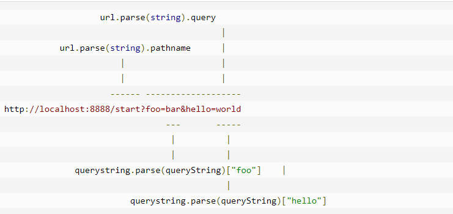
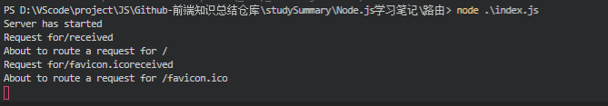
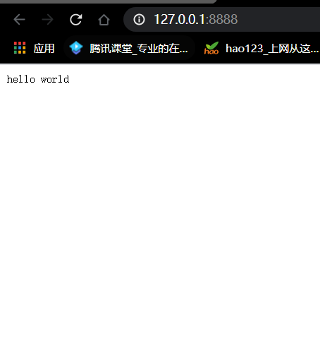

<!--
 * @Author: angula
 * @Date: 2020-09-22 17:00:28
 * @LastEditTime: 2020-09-23 14:34:22
 * @FilePath: \JS\Github-前端知识总结仓库\studySummary\Node.js学习笔记\路由\路由.md
-->
# 路由

我们需要为路由提供请求的URL和其他需要的GET以及POST操作，随后路由需要根据这些数据来执行相应的代码。
因此，我们需要查看 HTTP 请求，从中提取出请求的 URL 以及 GET/POST 参数。这一功能应当属于路由还是服务器（甚至作为一个模块自身的功能）确实值得探讨，但这里暂定其为我们的HTTP服务器的功能。

我们需要的所有数据都会包含在 request 对象中，该对象作为 onRequest() 回调函数的第一个参数传递。但是为了解析这些数据，我们需要额外的 Node.JS 模块，它们分别是 url 和 querystring 模块。



当然我们也可以用 querystring 模块来解析 POST 请求体中的参数。

## 找出浏览器请求的URL路径

server.js
```js
let http = require("http");
let url = require("url");
 
function start() {
  function onRequest(request, response) {
    var pathname = url.parse(request.url).pathname;
    console.log("Request for " + pathname + " received.");
    response.writeHead(200, {"Content-Type": "text/plain"});
    response.write("Hello World");
    response.end();
  }
 
  http.createServer(onRequest).listen(8888);
  console.log("Server has started.");
}
 
exports.start = start;
```

好了，应用现在可以通过请求的 URL 路径来区别不同请求了--这使得以使用路由（还未完成）来将请求以 URL 路径为基准映射到处理程序上。

在所要构建的应用中，这意味着来自 /start 和 /upload 的请求可以使用不同的代码来处理。稍后将看到这些内容是如何整合到一起的。

现在可以来编写路由了，建立一个名为 router.js 的文件

```js
function route(pathname) {
  console.log("About to route a request for " + pathname);
}
 
exports.route = route;
```
如你所见，这段代码什么也没干，不过对于现在来说这是应该的。在添加更多的逻辑以前，我们先来看看如何把路由和服务器整合起来。

我们的服务器应当知道路由的存在并加以有效利用。我们当然可以通过硬编码的方式将这一依赖项绑定到服务器上，但是其它语言的编程经验告诉我们这会是一件非常痛苦的事，因此我们将使用依赖注入的方式较松散地添加路由模块。

首先，我们来扩展一下服务器的 start() 函数，以便将路由函数作为参数传递过去，server.js 文件代码如下

```js
let http = require('http');
let url = require('url');


function start(route) {
  function onRequest(request, response) {
    let pathname = url.parse(request.url).pathname;
    console.log('Request for' + pathname + "received");

    route(pathname)

    response.writeHead(200, { "Content-Type": "text/plain" });
    response.write('hello world');
    response.end();
  }
  http.createServer(onRequest).listen(8888);
  console.log('Server has started')
}

exports.start = start;
```

然后将路由函数可以被注入到服务器中

index.js

```js
var server = require("./server");
var router = require("./router");
 
server.start(router.route);
```
如果现在启动应用，随后请求一个URL，你将会看到应用输出相应的信息，这表明我们的HTTP服务器已经在使用路由模块了，并会将请求的路径传递给路由：




