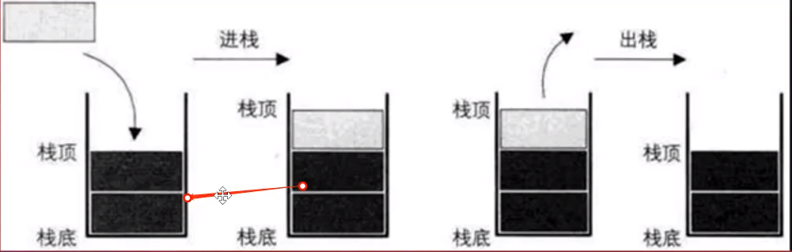
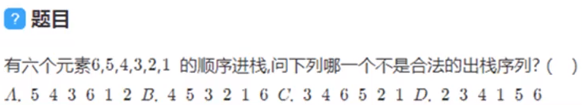
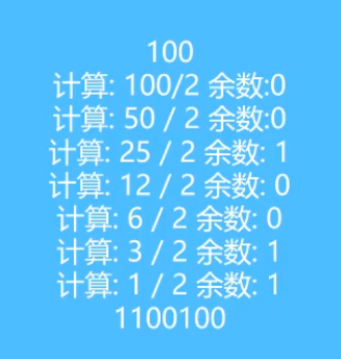

<!--
 * @Author: angula
 * @Date: 2020-09-10 19:35:16
 * @LastEditTime: 2020-09-10 22:37:19
 * @FilePath: \JS\Github-前端知识总结仓库\studySummary\js的数据结构笔记\栈结构\文档.md
-->
# 认识栈结构
1. 栈式一直受限的线性表(先进后出)(LIFO)
   - 其限制是仅允许在表的一端进行插入和删除运算，这一端被称为栈顶，另一端为栈底
   - LIFO(last in first out)表示后进入的元素，第一个被弹出栈空间
   - 向一个栈插入新元素称之为进栈，入栈，或压栈，它是把新元素放到栈顶元素的上面，使之成为新的栈顶元素
   - 从一个栈删除元素称为出栈或者退栈，它是把栈顶元素删除掉，使其相邻的元素称为新的栈顶


  
 

  ## 程序中什么是使用栈实现的？
  - 假设 A调用B，B调用C，C调用D
  - 那样在执行的过程中，会先将A压入栈，A没有执行完，所有不会弹出栈
  - 在A执行的过程中调用了B,会将B压入到栈，这个时候B在栈顶A在栈底
  - 如果这个时候B可以执行完，那么B会弹出栈.但是B有执行完吗?没有，它调用了C.
  - 所以C会压栈，并且在栈顶而C调用了D, D会压入到栈顶.
  - 所以当前的栈顺序是:栈底A-> B->C->D栈顶
  - D执行完，弹出栈. C/B/A依次弹出栈.
  - 所以我们有函数调用栈的称呼，就来自于它们内部的实现机制. (通过栈来实现的)

# 栈结构面试题


## 分析
答案：C
首先分析一下
题目的意思可不是说全部进栈然后再出栈，它是按照顺序进栈，但是不一定一次性全部进栈，中间进栈过程可以出栈的！

A. 分析一下A答案的可能性，如果5先出栈，那么必定是6 5 依次进栈，然后5出栈，然后4进栈，4出栈，然后3进栈，3出栈，此时栈里面只有6，此时6出栈，然后还剩余 2 1 未进栈，2进栈，1进栈，然后1出栈，2出栈。所以A答案是有可能的！

B.  首先6 5 4 依次进栈，然后4出栈，5出栈，然后3进栈，3出栈，2进栈，2出栈，1进栈，1出栈，然后6出栈，所以B答案也是有可能的

C. 3如果先出栈，需要 6 5 4 3依次进栈，然后3出栈，然后4出栈，此时栈中剩余6 5，此时5为栈顶，理应5出栈，所以C错误

D. 2 先出栈，所以6 5 4 3 2 依次进栈，然后2出栈，然后3出栈，然后4出栈，然后1进栈，然后1出栈，然后5出栈，然后6出栈。所以答案D是有可能的！

# 栈结构的实现
- 基于数组实现
- 基于链表实现

## 栈常见操作
- push(element):添加一个新元素到栈顶元素
- pop():移除栈顶的元素，同时返回被移除的元素
- peek()：返回栈顶的元素，不对栈做任何修改(只返回栈顶元素，但不会移除它)
- isEmpty()：若栈里没有任何元素就返回true，否则返回false
- size()：返回栈的元素个数
- toString()：将栈结构的内容以字符形式返回

## 栈的封装
```js
/*
 * @Author: angula
 * @Date: 2020-09-10 21:12:33
 * @LastEditTime: 2020-09-10 21:33:17
 * @FilePath: \JS\Github-前端知识总结仓库\studySummary\js的数据结构笔记\栈结构\栈的封装.js
 */
function Stack() {
  this.items = [];
  // 栈的相关操作实现
  // 1. 将元素压入栈
  Stack.prototype.push = function (element) {
    this.items.push(element);
  }
  // 2.从栈中取出元素
  Stack.prototype.pop = function () {
    return this.items.pop();
  }
  // 3. 查看栈顶元素
  Stack.prototype.peek = function () {
    return this.items[this.items.length - 1];
  }
  // 4. 判断栈中元素个数
  Stack.prototype.isEmpty = function () {
    return this.items.length == 0;
  }
  // 5. 获取栈中元素个数
  Stack.prototype.size = function () {
    return this.items.length;
  }
  // 6 toString方法
  Stack.prototype.toString = function () {
    var result = '';
    for (var i = 0; i < this.items.length; i++) {
      result += this.items[i] + ' ';
    }
    return result;
  }
}
var s = new Stack();

s.push(1);
s.push(2);
s.push(3);
s.push(4);
console.log('栈内元素：', s.items);

console.log('取出的元素为', s.pop())
console.log('取出元素后：', s.items);


console.log('此时栈顶元素', s.peek())
console.log(s.toString())
```

# 十进制转换为二进制
首先要了解其转换过程：




```js
function dec2bin(decNumber) { 
  //  定义一个栈对象
  var stack = new Stack();

  // 循环操作 
  while (decNumber > 0) {
    stack.push(decNumber % 2);
    decNumber = Math.floor(decNumber / 2);
  }

  // 输出结果
  var result = '';
  while (!stack.isEmpty()) {
    result += stack.pop();
  }
  return result;

}
console.log(dec2bin(100));  //1100100
```